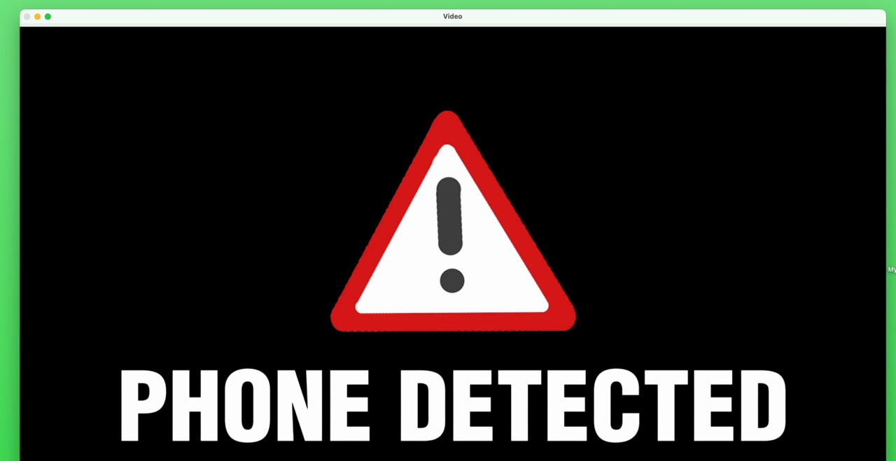

# YOLOv11 Phone Detector 📱

A phone detector to help you stop procrastinating on your work. When a phone is detected in the view of your webcam, it will remind you to lock in. Built using YOLOv11 and OpenCV.




## Features

- Real-time detection of cell phones using YOLOv11
- Automatic video playback when phone is detected
- Low-latency webcam processing

## Setup

1. Create and activate virtual environment:
```bash
uv venv
.venv\Scripts\activate
```

2. Install dependencies:
```bash
uv pip install -r requirements.txt
```

3. A sample video (`sample_video.mp4`) is included. You can use this or replace it with your own video file.

4. Run the script:
```bash
python app.py
```

## Configuration

Edit the configuration section at the top of `app.py`:

```python
MODEL_PATH = "yolo11s.pt" # YOLO model to use (use yolo11n.pt if your computer is slow)
VIDEO_PATH = "sample_video.mp4" # Sample video included, or replace with your own
```

Advanced config:

```python
TARGET_CLASSES = {"cell phone", "remote"} # Objects to detect
CONF_THRESHOLD = 0.4 # Confidence threshold (0.0-1.0)
COOLDOWN_SEC = 3.0 # Minimum time between triggers
STREAK_REQUIRED = 15 # Consecutive detections needed to trigger
MIN_BOX_AREA_RATIO = 0.01 # Minimum detection size (1% of frame)
```

## How It Works

1. The script continuously monitors your webcam feed
2. When it detects a cell phone with sufficient confidence and size
3. It requires 15 consecutive frames with valid detections (debouncing)
4. After the cooldown period, it plays the specified video in a new window
5. The video window can be resized and moved, and stays on top

## Controls

- Press 'q' in the detection window to quit the application
- Press 'q' in the video window to stop video playback and return to detection
- Press Ctrl+C to force quit

## Requirements

- Python 3.7+
- UV fast package manager
- Webcam
- The script will automatically download YOLO models on first run
- Video files should be in a format supported by ffpyplayer (MP4, AVI, etc.)

## Notes

- Make sure your webcam is connected and working
- The script uses debouncing to prevent false triggers
- Video playback is handled by ffpyplayer for better performance
- Detection parameters can be tuned based on your specific use case